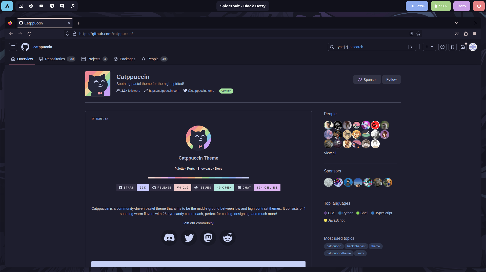
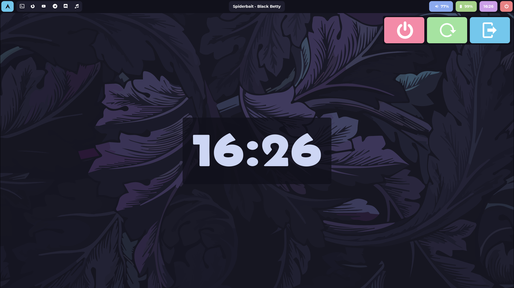

# Hyprland Rice
Catppuccin hyprland theme by maxtaran2010 (aka tmasik.t)
## Things that I use
### Apps
`eww` `hyprland` `hyprpaper` `wofi` `hyprshot` `swaylock` `neovim` `kitty`
### Fonts
`Nerd Fonts` `Belanosima` `Montserrat`
### Other things
`mpd` (for music) `hyprctl`
## Keybindings
SUPER + {1-10} - workspace {1-10}
SUPER + SHIFT + {1-10} - move window to workspace {1-10}
SUPER + PRINT - screenshot (region)
SUPER + Enter - terminal
SUPER + C - kill window
SUPER + SHIFT + q - exit HyprLand
SUPER + S - toggle window floating
SUPER + T - toggle window pseudo tiling
SUPER + J  - toggle split mode
SUPER + D - wofi
SUPER + scroll - switch between workspaces

## Pics

