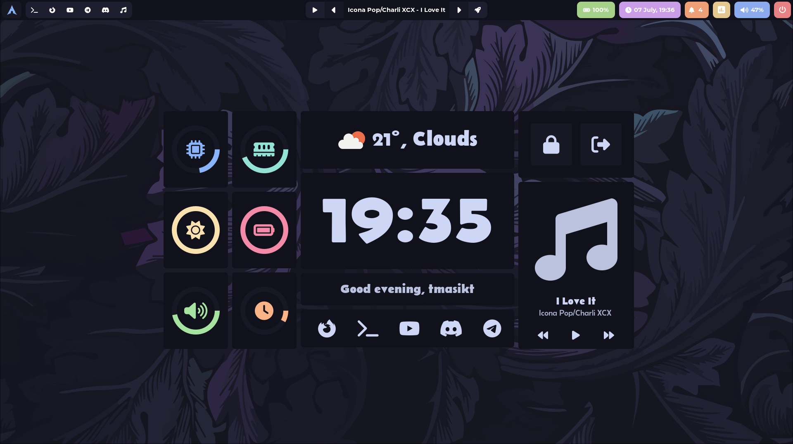
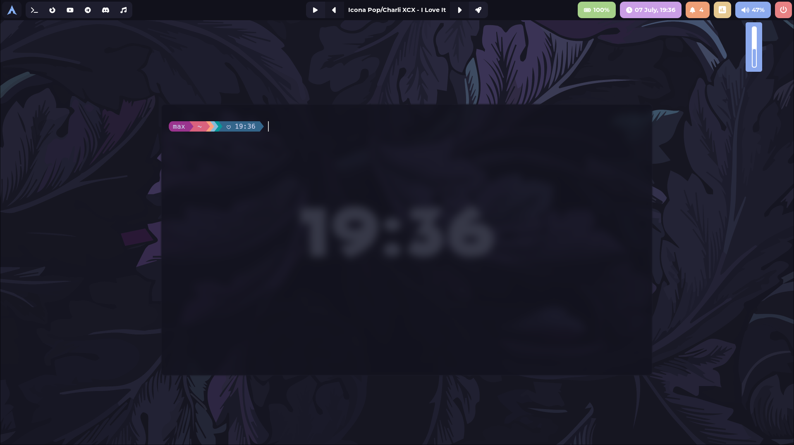

# Hyprland Rice
Catppuccin hyprland theme by maxtaran2010 (aka tmasik.t)
## Things that I use
### Apps
`eww` `hyprland` `hyprpaper` `wofi` `hyprshot` `swaylock` `neovim` `kitty` `swaync`
### Fonts
`Nerd Fonts` `Belanosima` `Montserrat`
### Other things
`mpd` (for music) `hyprctl` `upower` `python`
## Keybindings
SUPER + {1-10} - workspace {1-10}  
SUPER + SHIFT + {1-10} - move window to workspace {1-10}  
SUPER + PRINT - screenshot (region)  
SUPER + Enter - terminal  
SUPER + C - kill window  
SUPER + SHIFT + q - exit HyprLand  
SUPER + S - toggle window floating  
SUPER + T - toggle window pseudo tiling  
SUPER + J  - toggle split mode  
SUPER + D - wofi  
SUPER + scroll - switch between workspaces  

## Music

Music in bar and in dashboard is only working with mpd, but there is a branch with any player (using `playerctl`)

## Pics

